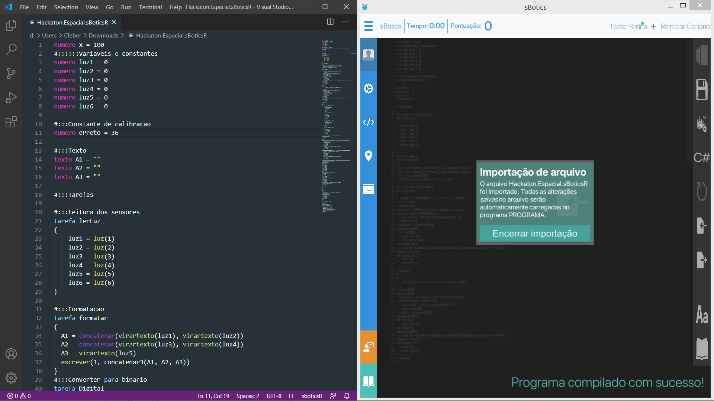
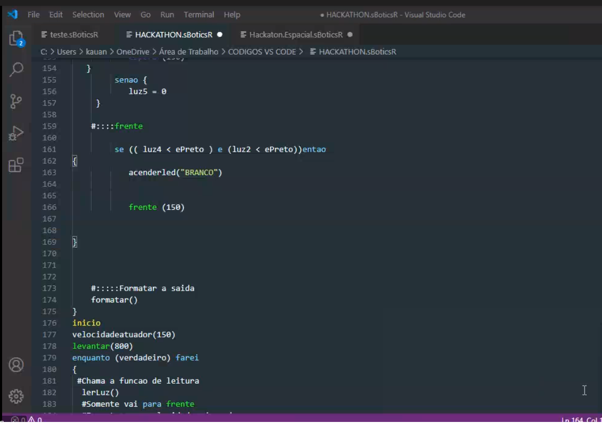

# :rocket: HackathonAEB :robot:
Participação sob minha orientação, em equipe do Hackathon Espacial organizado pela Agência Espacial Brasileira em 2020, com tema Exploração Lunar através de robôs autônomos.
### Objetivo :heavy_check_mark:
Programar e controlar um robô inteligente, em uma simulação de uma missão de transporte de materiais para uma base lunar.
### Problematização :heavy_check_mark:
Prosseguir por um caminho desconhecido, enfrentando vários obstáculos até chegar em segurança na base cientifica com as amostras coletadas utilizando código de programação.
### Solução :heavy_check_mark:
Desenvolvimento de uma programação, eficaz e otimizada, dividida em tarefas para que fique organizada, com uma escrita clara e limpa, superandos os desafios enfrentados durante o percurso, para que chegue até a base científica com total segurança cumprindo todas as metas estipuladas; as coletas dos dados dos sensores durante o trajeto serão armazenadas, tratadas e com base nos resultados e cálculos o robô tomará decisões para prosseguir no trajeto até cumprir a missão.
# :computer: Código comentado 
**Linguagem R-Educ**
```
#::::::Variaveis e constantes                     // Coloca os sensores de cor no valor inicial 0;
numero luz1 = 0
numero luz2 = 0
numero luz3 = 0
numero luz4 = 0
numero luz5 = 0
numero luz6 = 0

#:::Constante de calibração                       // Define o valor de corte para “ePreto”
numero ePreto = 27                                // 27 é o valor mediano analisando a variação de luz
#:::Tarefas
#:::Leitura dos sensores
tarefa lerLuz                                     // tarefa que define o input dos sensores
{
luz1 = luz(1)
luz2 = luz(2)
luz3 = luz(3)
luz4 = luz(4)
luz5 = luz(5)
luz6 = luz(6)
}
#:::Converter para binário                        // Converte os dados recebidos em binários
tarefa Digital{
se((ultra(3) <= 70) e (ultra(4) <= 70)) entao{    // É a função que identifica rampa
acenderled("VERMELHO")
repita 1 vezes {                                      =====================
se ((luz(3) <=30 )) entao {
frente(200)
esperar(300)                                      
apagarled() para 200                                Aceleração dos motores de 110
se ((luz(3) >=30 )) entao {
frente(200)
esperar(300)}
}                                                     =======================
}
se((inclinacao() >= 350)) entao{                    // Identifica a chegada a base cientifica
acenderled("VERDE")                                 // Sinal luminoso
tocar(1, "DO", 100)                                 // Inicio da função sinal sonoro
tocar(2, "RE", 175)
tocar(3, "MI", 250)
tocar(4, "FA", 250)
tocar(5, "MI", 250)
tocar(6, "RE", 250)
tocar(7, "DO", 250)
tocar(8, "RE", 250)
tocar(9, "RE", 175)
tocar(10, "MI", 175)
tocar(11, "FA", 250)
tocar(12, "SOL", 250)
tocar(13, "FA", 250)
tocar(14, "FA", 500)
tocar(15, "SOL", 175)
tocar(16, "FA", 175)
tocar(17, "MI", 175)
tocar(18, "RE", 250)
tocar(19, "DO", 500)
tocar(20, "DO", 250)
tocar(21, "RE", 250)
tocar(22, "MI", 250)
tocar(23, "FA", 250)
tocar(24, "SOL", 250)
tocar(25, "DO", 250)
tocar(26, "RE", 250)
tocar(27, "MI", 175)
tocar(28, "FA", 250)
tocar(29, "SOL", 250)
tocar(30, "RE", 250)
tocar(31, "RE", 250)
tocar(32, "DO", 250)
tocar(33, "DO", 250)
}
}
se (ultra(1) <= 17) entao{                        // Uma distância menor que 17 significa obstáculo a frente
acenderled("AZUL")                                      =========================================
direita(300)
esquerda(negativo(300))
esperar(1500)
frente(200)                                             
esperar(600)
esquerda(300)                                           MANOBRA DE ALINHAMENTO LATERAL AO OBSTACULO
direita(negativo(300))
esperar(1500)
frente(200)
esperar(400)
#                                                       ===========================================
enquanto(luz(3) >= 30) farei{
se((ultra(4) <= 60)) entao{
frente(200)
esperar(0)
}
se((ultra(4) > 60)) entao{                          //LEITURA DA POSIÇÃO DO OBSTACULO
esquerda(300)
esperar(1200)
}
se((luz(5) <= 30)) entao {
frente(200)
esperar(400)                                        //MANOBRA DE RECUPERAÇÃO DE LINHA
enquanto((luz(3) >= 30)) farei {direita(300)}
se((luz(3) <= 30)) entao {
tras(70)
esperar(10)
}
}
}
}
                                                    // INICIO DAS FUNÇOES DE SEGUIMENTO DE LINHA
                                                    // SE UM SENSOR EXTERNO TEM A LEITURA
                                                       IGUAL A PRETO, O ROBO SE MOVE PARA FRENTE,
                                                       SE O SENSOR INTERNO FOR
                                                       PRETO ENTAO CURVA DE 90 GRAUS
se ((luz5 < ePreto)) entao {
frente(200)
esperar(15)
se ((luz5 < ePreto) e (luz4 < ePreto)) entao {
acenderled("VERMELHO")                              // MANOBRA 90 ESQUERDA
frente(200)
esperar(220)
esquerda(500)
esperar(1200)
farei {esquerda(300) direita(negativo(300))}enquanto(luz(3) >= ePreto)
}
} senao {
}
#::::
se ((luz1 < ePreto)) entao
{
frente(200)
esperar(15)
se ((luz1 < ePreto) e (luz2 < ePreto)) entao{
acenderled("VERMELHO")                              // MANOBRA 90 DIREITA
frente(200)
esperar(220)
direita(300)
esperar(1200)
farei {direita(300) esquerda(negativo(300))}enquanto(luz(3) >= ePreto)
}
} senao{
}
#::::                                               //SEGUIMENTO DE LINHA COMUM 5 SENSORES, E CONVERSÃO BINARIA
se ( luz2 < ePreto ) entao
{
luz2 = 1
acenderled("PRETO")
direita(300)
esperar(200)
}
senao {
luz2 = 0
}
se ( luz1 < ePreto ) entao
{
luz1 = 1
acenderled("PRETO")
direita(300)
esperar(200)
}
senao {
luz1 = 0
}
se ( luz4 < ePreto ) entao
{
luz4 = 1
acenderled("PRETO")
esquerda(300)
esperar(200)
}
senao{
luz4 = 0
}
se ( luz5 < ePreto ) entao
{
luz5 = 1
acenderled("PRETO")
esquerda(300)
esperar(150)
}
senao {
luz5 = 0
}
se ( luz3 < ePreto ) entao
{
luz3 = 1
acenderled("BRANCO")
frente(120)
}
}
tarefa obstaculo{                                     // TAREFA QUE IDENTIFICA O OBSTÁCULO
se ((ultra(2) <= 17)) entao{
acenderled("AZUL")
#tras(200)
#esperar(100)
#
direita(300)
esquerda(negativo(300))
esperar(1500)
frente(200)
esperar(600)
esquerda(300)
direita(negativo(300))
esperar(1500)
frente(200)
esperar(400)
#
enquanto(luz(3) >= 30) farei{
se((ultra(4) <= 60)) entao{
frente(70)
esperar(0)
}
se((ultra(4) > 60)) entao{
esquerda(300)
esperar(1200)
}
se((luz(5) <= 30)) entao {
frente(200)
esperar(400)
enquanto((luz(3) >= 30)) farei {direita(300)}
se((luz(3) <= 30)) entao {
tras(70)
esperar(10)
}
interromper()
}
}
}
}
inicio                                            // FUNCÕES DE EXECUÇÃO CONTÍNUA
velocidadeatuador(150)
levantar(800)
enquanto (verdadeiro) farei
{
#Chama a funcao de leitura
lerLuz()
#Chama a funcao de conversao
Digital()
}
fim
```
## Visual Studio e R-Educ


